# Omdo 2D Requirement

Each item has : Front, Side, 3/4 view

1. Brows (2)
	1. Normal
	2. Mengkerut / sedih

2. Eye Left & Right (5)
	1. Eye Normal
	2. Eye Squint / setengah merem
	3. Eye Close-Normal
	4. Close-Smile
	5. Close-Scared

3. Nose : (1)
4. Mouth : (12)
	1. Normal
	3. Smile
	3. OpenLip
	4. A
	5. I
	6. U
	7. E
	8. O
	9. FV
	10. Oh
	11. LNDTh
	12. CDSKZ

6. Hair : (3) rambut omdo 3-3 nya dipisah 

## Gambar :
2. Eye
	1. Eye Normal
		   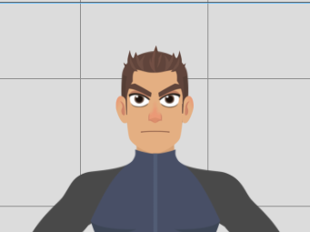   
	2. Eye Squint
		   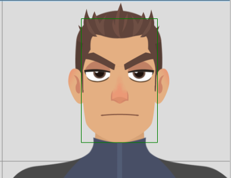   
	3. Eye Close
		1. Close-Normal
			   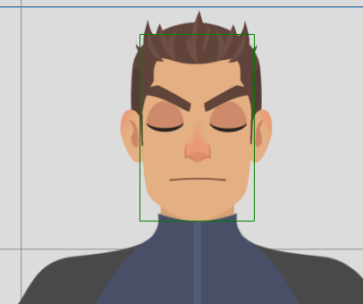   
		2. Close-Smile
			   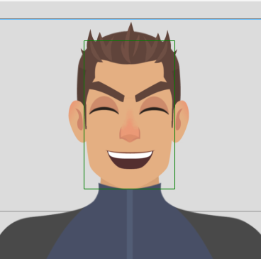   
		3. Close-Scared
			   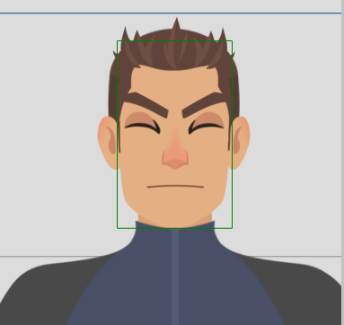   
			
4. Mouth : 12
	1. Normal
	          
	3. Smile
		   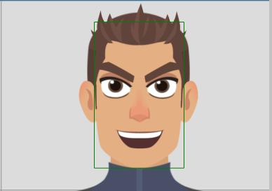   
	3. OpenLip
		      
	4. A
		   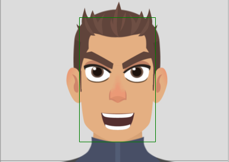   
	5. I
		   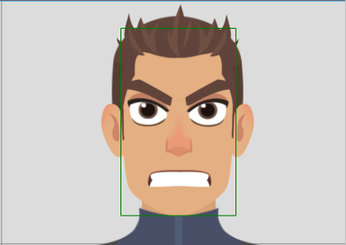   
	6. U
		   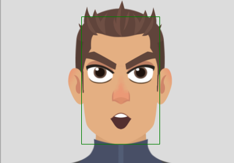   
	7. E
		      
	8. O
        	   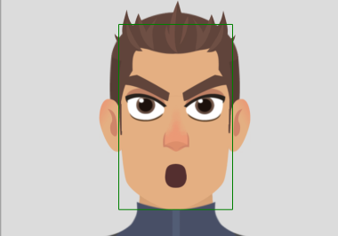   
	9. FV
		   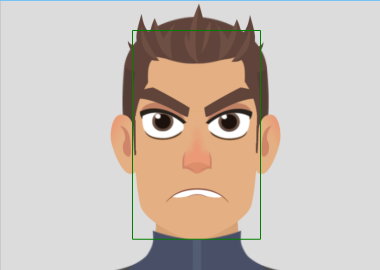   
	10. Oh
		   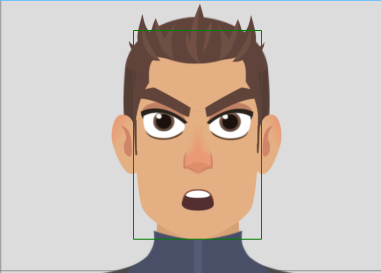   
	11. LNDTh
		      
	12. CDSKZ
		      
